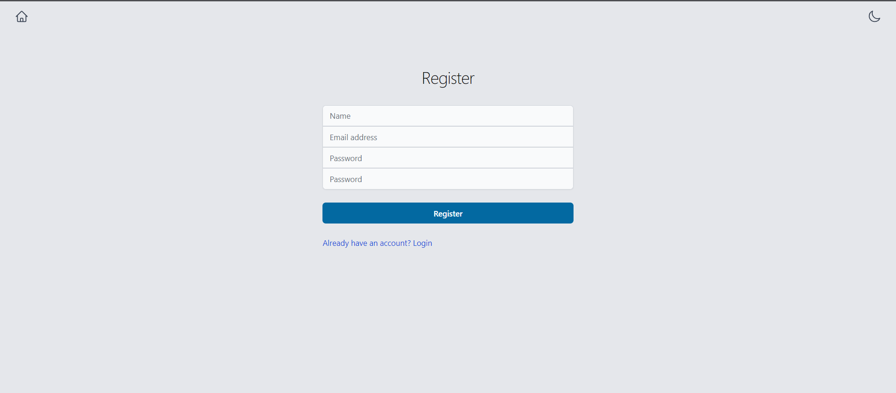
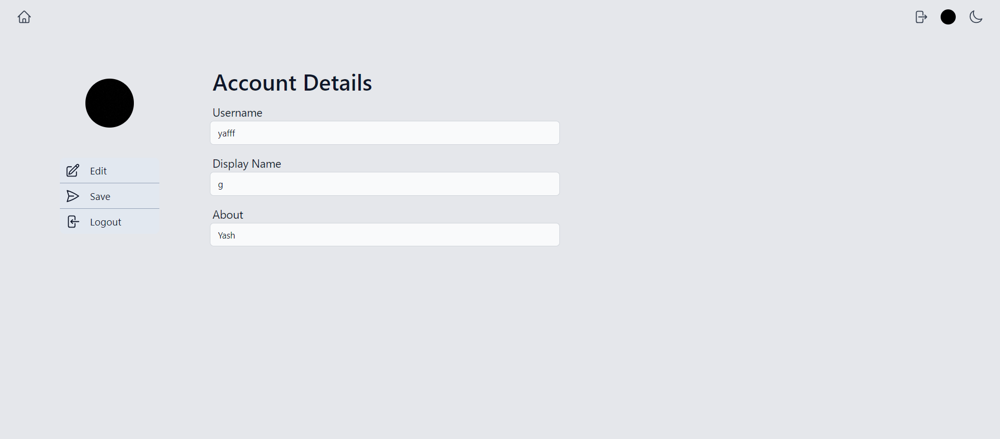
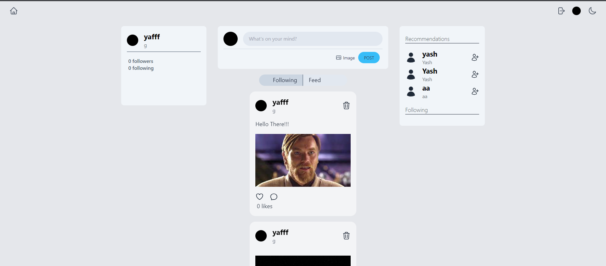
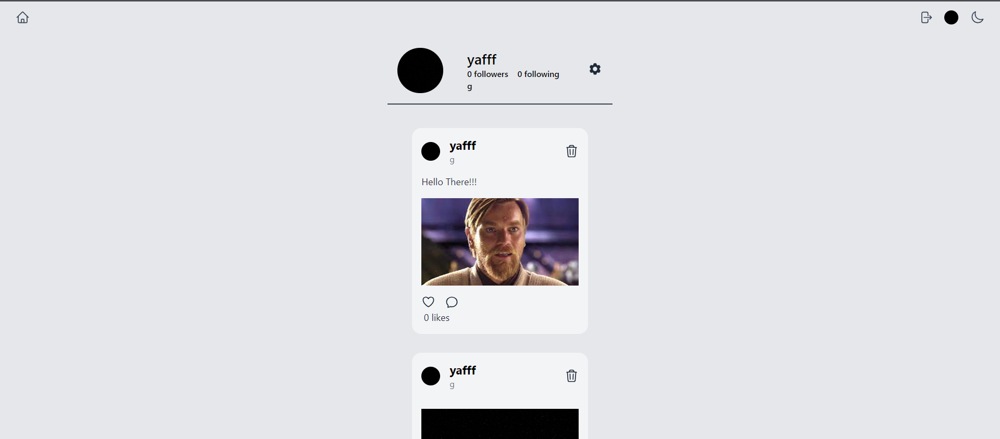

# MESH
Social media app

# Feature:
- Allows to upload image and text post and set like or comments.
- Allows to follow and get followed back.
- One can check others porfile (post timeline)
- Dark Mode
- Responsive design

# Preview





## Local Setup
- Clone the repository.
```
git clone https://github.com/Yaxhveer/Mesh.git
cd Mesh
```
- Install the dependency and start the fronend.
```
cd frontend && npm install
npm run dev
```
- Install the dependency and start the server.
```
cd ../server && npm install
nodemon
```
Create a new postgres database and run `database.sql` inside the database. This will setup all the tables necessary for the server to work.
Create a `.env` file inside the server directory with reference to the `.env.example`

## Technology and Tools
- PostgresSQL
- ExpressJS
- ReactJS
- NodeJS
- TailwindCSS
- JWT


